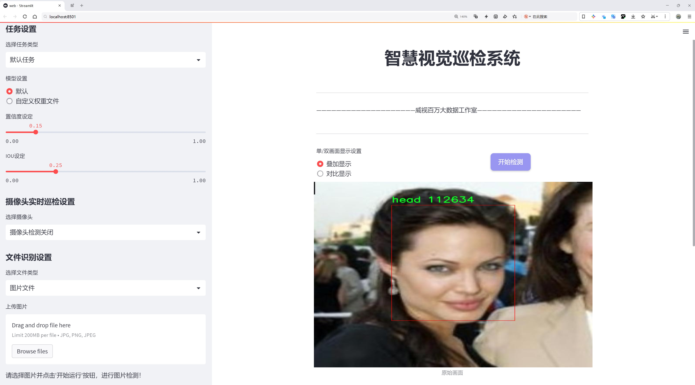
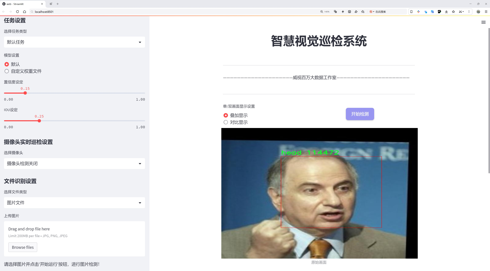
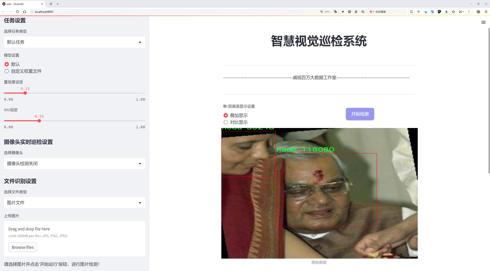
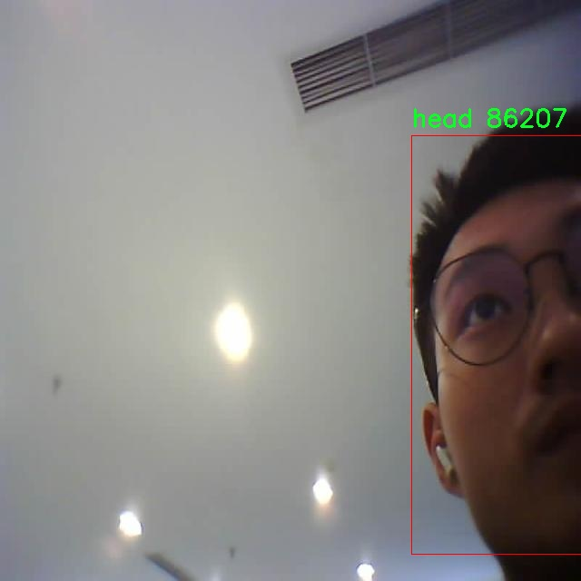
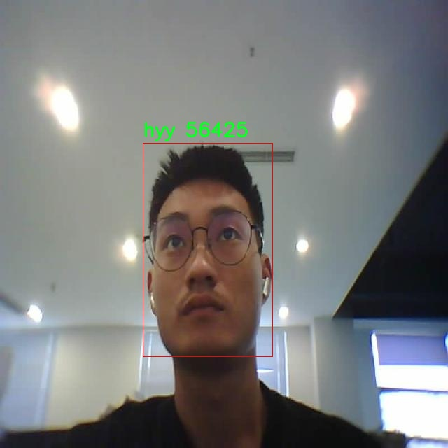
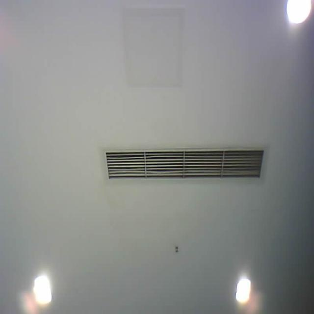
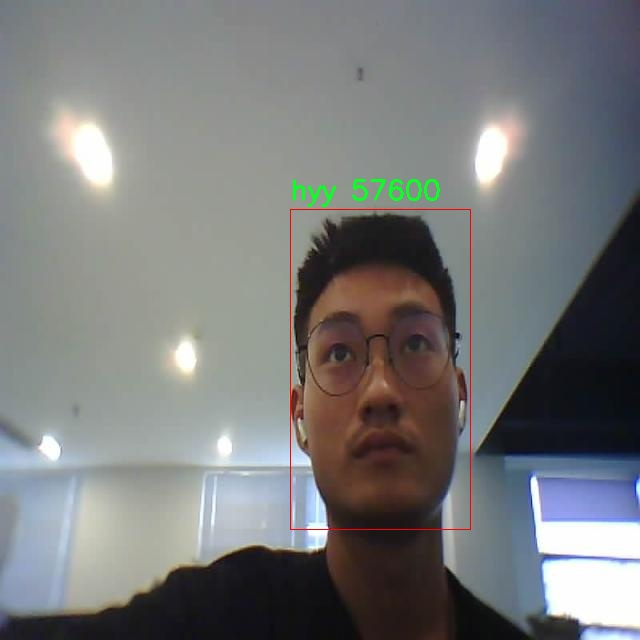
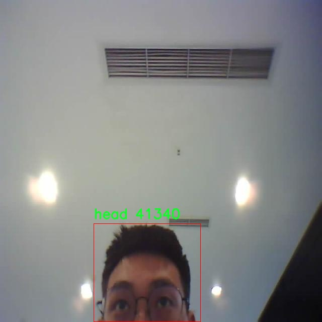

# 头部检测检测系统源码分享
 # [一条龙教学YOLOV8标注好的数据集一键训练_70+全套改进创新点发刊_Web前端展示]

### 1.研究背景与意义

项目参考[AAAI Association for the Advancement of Artificial Intelligence](https://gitee.com/qunshansj/projects)

项目来源[AACV Association for the Advancement of Computer Vision](https://gitee.com/qunmasj/projects)

研究背景与意义

随着计算机视觉技术的迅速发展，目标检测作为其重要分支之一，已经在多个领域得到了广泛应用，如智能监控、自动驾驶、医疗影像分析等。目标检测的核心任务是从图像中识别并定位特定对象，这一过程通常涉及到复杂的算法和大量的数据处理。近年来，YOLO（You Only Look Once）系列模型因其高效性和实时性而受到广泛关注，尤其是YOLOv8的推出，进一步提升了目标检测的性能和准确性。然而，针对特定应用场景的定制化需求日益增加，尤其是在头部检测领域，亟需对现有模型进行改进和优化。

头部检测作为人脸识别、行为分析等技术的基础，具有重要的研究价值和应用前景。在公共安全、智能监控等领域，准确的头部检测不仅能够提升系统的智能化水平，还能为后续的人脸识别和行为分析提供可靠的数据支持。现有的头部检测技术虽然在一定程度上取得了进展，但仍然面临着多种挑战，如不同角度、遮挡、光照变化等因素对检测精度的影响。因此，基于YOLOv8的改进方案，专注于头部检测的研究，具有重要的理论意义和实际应用价值。

本研究所使用的数据集包含2400张图像，涵盖了三类目标：头部（head）、hyy和zzd。这一数据集的多样性为模型的训练和测试提供了丰富的样本，能够有效提高模型的泛化能力。通过对数据集的深入分析，我们可以识别出不同类别之间的特征差异，从而为模型的改进提供数据支持。特别是在头部检测中，如何有效地处理不同姿态、表情和环境条件下的头部图像，将是本研究的重点之一。

在模型改进方面，我们将探索引入先进的特征提取技术和数据增强方法，以提升YOLOv8在头部检测任务中的表现。通过对模型架构的优化和训练策略的调整，我们期望能够显著提高检测的准确率和实时性。此外，结合深度学习的最新进展，我们还将尝试集成多种模型和算法，以构建一个更加鲁棒的头部检测系统。

综上所述，基于改进YOLOv8的头部检测系统的研究，不仅能够推动目标检测技术的发展，还能为相关应用领域提供强有力的技术支持。通过深入分析数据集、优化模型架构以及探索新的算法，我们期望能够在头部检测领域取得突破性进展，为未来的智能监控和人机交互等应用奠定坚实的基础。这一研究不仅具有重要的学术价值，也将为实际应用提供切实可行的解决方案，推动智能技术的进一步发展。

### 2.图片演示







##### 注意：由于此博客编辑较早，上面“2.图片演示”和“3.视频演示”展示的系统图片或者视频可能为老版本，新版本在老版本的基础上升级如下：（实际效果以升级的新版本为准）

  （1）适配了YOLOV8的“目标检测”模型和“实例分割”模型，通过加载相应的权重（.pt）文件即可自适应加载模型。

  （2）支持“图片识别”、“视频识别”、“摄像头实时识别”三种识别模式。

  （3）支持“图片识别”、“视频识别”、“摄像头实时识别”三种识别结果保存导出，解决手动导出（容易卡顿出现爆内存）存在的问题，识别完自动保存结果并导出到tempDir中。

  （4）支持Web前端系统中的标题、背景图等自定义修改，后面提供修改教程。

  另外本项目提供训练的数据集和训练教程,暂不提供权重文件（best.pt）,需要您按照教程进行训练后实现图片演示和Web前端界面演示的效果。

### 3.视频演示

[3.1 视频演示](https://www.bilibili.com/video/BV1YWtYeCEwC/)

### 4.数据集信息展示

##### 4.1 本项目数据集详细数据（类别数＆类别名）

nc: 3
names: ['head', 'hyy', 'zzd']


##### 4.2 本项目数据集信息介绍

数据集信息展示

在本研究中，我们采用了名为“head”的数据集，以支持对YOLOv8头部检测系统的改进与优化。该数据集专门针对头部检测任务进行了精心设计，包含了多样化的样本，以确保模型在实际应用中的鲁棒性和准确性。数据集的类别数量为3，具体类别包括“head”、“hyy”和“zzd”。这些类别的选择反映了我们在不同场景下对头部检测的需求，涵盖了各种可能的头部形态和特征。

首先，类别“head”是数据集的核心，代表了我们主要关注的目标。该类别包含了多种姿态、角度和表情的头部图像，确保模型能够在不同的环境和条件下有效识别和定位头部。这些图像不仅包括了正面视角，还涵盖了侧面、俯视和仰视等多种角度，使得模型在实际应用中能够具备更强的适应性。

其次，类别“hyy”则代表了一种特定类型的头部特征，可能与特定的行为或状态相关联。这一类别的样本经过精心挑选，旨在帮助模型学习识别与“hyy”相关的独特特征，从而提高其在特定场景下的检测精度。通过引入这一类别，我们希望模型能够在复杂的背景中，准确区分出不同类型的头部特征，从而提升整体检测性能。

最后，类别“zzd”则可能代表另一种特定的头部特征或行为模式。与“hyy”类似，这一类别的样本同样经过严格筛选，确保其在训练过程中能够有效地为模型提供多样化的学习素材。通过引入这些特定类别，我们希望模型能够在不同的应用场景中，具备更高的识别能力和灵活性。

数据集“head”的构建不仅考虑了样本的多样性，还注重了数据的标注质量。每一张图像都经过了精确的标注，确保在训练过程中，模型能够获取到准确的位置信息和类别标签。这种高质量的标注将直接影响到模型的训练效果，使得最终的检测系统在面对真实世界的挑战时，能够展现出更强的性能。

此外，数据集的规模和丰富性也是其成功的关键因素之一。通过收集来自不同环境、不同光照条件和不同背景的图像，我们确保了数据集的全面性和代表性。这种多样化的样本库不仅能够帮助模型学习到更广泛的特征，还能有效减少过拟合的风险，从而提升模型在未见数据上的泛化能力。

综上所述，数据集“head”以其丰富的类别和高质量的标注，为改进YOLOv8的头部检测系统提供了坚实的基础。通过对这一数据集的深入分析和应用，我们期待能够显著提升头部检测的准确性和效率，为相关领域的研究和应用提供有力支持。











### 5.全套项目环境部署视频教程（零基础手把手教学）

[5.1 环境部署教程链接（零基础手把手教学）](https://www.ixigua.com/7404473917358506534?logTag=c807d0cbc21c0ef59de5)


[5.2 安装Python虚拟环境创建和依赖库安装视频教程链接（零基础手把手教学）](https://www.ixigua.com/7404474678003106304?logTag=1f1041108cd1f708b01a)

### 6.手把手YOLOV8训练视频教程（零基础小白有手就能学会）

[6.1 手把手YOLOV8训练视频教程（零基础小白有手就能学会）](https://www.ixigua.com/7404477157818401292?logTag=d31a2dfd1983c9668658)

### 7.70+种全套YOLOV8创新点代码加载调参视频教程（一键加载写好的改进模型的配置文件）

[7.1 70+种全套YOLOV8创新点代码加载调参视频教程（一键加载写好的改进模型的配置文件）](https://www.ixigua.com/7404478314661806627?logTag=29066f8288e3f4eea3a4)

### 8.70+种全套YOLOV8创新点原理讲解（非科班也可以轻松写刊发刊，V10版本正在科研待更新）

由于篇幅限制，每个创新点的具体原理讲解就不一一展开，具体见下列网址中的创新点对应子项目的技术原理博客网址【Blog】：


[8.1 70+种全套YOLOV8创新点原理讲解链接](https://gitee.com/qunmasj/good)

### 9.系统功能展示（检测对象为举例，实际内容以本项目数据集为准）

图9.1.系统支持检测结果表格显示

  图9.2.系统支持置信度和IOU阈值手动调节

  图9.3.系统支持自定义加载权重文件best.pt(需要你通过步骤5中训练获得)

  图9.4.系统支持摄像头实时识别

  图9.5.系统支持图片识别

  图9.6.系统支持视频识别

  图9.7.系统支持识别结果文件自动保存

  图9.8.系统支持Excel导出检测结果数据


### 10.原始YOLOV8算法原理

原始YOLOv8算法原理

YOLOv8模型是由Ultralytics团队在2023年1月推出的，作为YOLO系列的最新版本，它在YOLOv5的基础上进行了多项重要改进，吸收了过去两年半内在实际应用中获得的经验和技术创新。YOLOv8不仅在精度和速度上有所提升，还在模型结构和训练策略上进行了优化，旨在满足现代目标检测任务对实时性和准确性的双重需求。

YOLOv8的网络结构由多个模块组成，首先是输入层。在图像输入方面，YOLOv8采用了640x640的默认输入尺寸，但为了适应不同长宽比的图像，模型在推理时使用自适应图像缩放技术。这种方法通过将较长的一边按比例缩小到指定尺寸，然后对短边进行填充，减少了信息冗余，从而提高了目标检测的效率。此外，YOLOv8在训练过程中引入了Mosaic数据增强技术，尽管在最后10个epoch中停止使用该增强，以避免破坏数据的真实分布。Mosaic增强通过随机选择四张图像进行缩放和拼接，迫使模型学习不同位置和周围像素的变化，显著提高了模型的鲁棒性和泛化能力。

在主干网络方面，YOLOv8对C3模块进行了替换，采用了C2f模块。C2f模块借鉴了YOLOv7中的ELAN设计理念，通过引入更多的跳层连接，增强了梯度流的信息传递能力。这种结构不仅提高了特征提取的精度，还保证了模型的轻量化，使得YOLOv8在计算资源有限的情况下依然能够高效运行。同时，YOLOv8保留了SPPF模块，以提高计算速度，确保在特征提取过程中不会造成性能的下降。

在颈部网络的设计上，YOLOv8同样进行了重要的改进。所有的C3模块被替换为C2f模块，并且在上采样之前去除了两处卷积连接层，直接将不同阶段的特征进行上采样。这种简化的结构使得特征融合更加高效，有助于提高模型的整体性能。

YOLOv8的头部网络是其最显著的创新之一，采用了解耦头的设计思路，将检测和分类任务分为两个并行的分支。分类分支专注于分析特征图中的类别特征，而定位分支则关注边界框与真实框之间的关系。这种解耦设计使得模型在训练时能够更快收敛，并提高了预测的精度。此外，YOLOv8摒弃了传统的锚框结构，转而采用无锚框的方法，直接预测目标的中心位置。通过引入任务对齐学习（Task Alignment Learning, TAL），YOLOv8能够更好地区分正负样本，并利用分类分数和交并比（IoU）的高次幂乘积作为衡量任务对齐程度的指标。这一创新使得模型在定位和分类的损失函数中引入了新的评价标准，从而提升了整体的检测性能。

在损失函数的设计上，YOLOv8针对训练和推理过程中存在的逻辑不一致性进行了优化。它取消了对象分支，依然在分类分支中使用二值交叉熵损失（BCELoss），而在边界框回归分支中则采用了分布焦点损失（DFL）和CIoU损失。这种组合的损失函数使得网络模型能够更快地聚焦于标签附近的数值，提高了模型的定位精度。

通过以上的结构和算法创新，YOLOv8在目标检测任务中表现出了优越的性能。在COCO数据集上的实验结果显示，YOLOv8在同等模型尺寸下，相较于其他YOLO系列模型，能够在保持较小参数量的同时，显著提高检测精度和推理速度。这一系列的改进使得YOLOv8成为了一个高效、灵活且易于使用的目标检测工具，适用于广泛的应用场景。

综上所述，YOLOv8通过对网络结构的优化、训练策略的调整以及损失函数的创新，成功地提升了目标检测的性能，满足了现代应用对实时性和准确性的需求。作为YOLO系列的最新成员，YOLOv8不仅继承了前几代模型的优点，还在多个方面进行了创新，为目标检测领域的发展提供了新的动力和方向。


### 11.项目核心源码讲解（再也不用担心看不懂代码逻辑）

#### 11.1 70+种YOLOv8算法改进源码大全和调试加载训练教程（非必要）\ultralytics\models\sam\modules\tiny_encoder.py

以下是对给定代码的核心部分进行分析和详细注释的结果。代码主要实现了一个名为 `TinyViT` 的视觉模型架构，结合了卷积层和自注意力机制。

```python
import itertools
from typing import Tuple
import torch
import torch.nn as nn
import torch.nn.functional as F
import torch.utils.checkpoint as checkpoint

class Conv2d_BN(torch.nn.Sequential):
    """一个顺序容器，执行2D卷积操作，后接批量归一化。"""

    def __init__(self, in_channels, out_channels, kernel_size=1, stride=1, padding=0, dilation=1, groups=1, bn_weight_init=1):
        """初始化卷积层和批量归一化层。"""
        super().__init__()
        self.add_module('conv', torch.nn.Conv2d(in_channels, out_channels, kernel_size, stride, padding, dilation, groups, bias=False))
        bn = torch.nn.BatchNorm2d(out_channels)
        torch.nn.init.constant_(bn.weight, bn_weight_init)  # 初始化批量归一化的权重
        torch.nn.init.constant_(bn.bias, 0)  # 初始化偏置为0
        self.add_module('bn', bn)

class PatchEmbed(nn.Module):
    """将图像嵌入为补丁并投影到指定的嵌入维度。"""

    def __init__(self, in_chans, embed_dim, resolution, activation):
        """初始化补丁嵌入层。"""
        super().__init__()
        img_size: Tuple[int, int] = (resolution, resolution)  # 假设输入图像为正方形
        self.patches_resolution = (img_size[0] // 4, img_size[1] // 4)  # 每个补丁的分辨率
        self.num_patches = self.patches_resolution[0] * self.patches_resolution[1]  # 总补丁数
        self.in_chans = in_chans
        self.embed_dim = embed_dim
        n = embed_dim
        self.seq = nn.Sequential(
            Conv2d_BN(in_chans, n // 2, 3, 2, 1),  # 第一个卷积层
            activation(),  # 激活函数
            Conv2d_BN(n // 2, n, 3, 2, 1),  # 第二个卷积层
        )

    def forward(self, x):
        """通过补丁嵌入层的序列操作处理输入张量。"""
        return self.seq(x)

class Attention(torch.nn.Module):
    """多头自注意力模块，支持空间感知。"""

    def __init__(self, dim, key_dim, num_heads=8, attn_ratio=4, resolution=(14, 14)):
        """初始化注意力模块。"""
        super().__init__()
        assert isinstance(resolution, tuple) and len(resolution) == 2
        self.num_heads = num_heads
        self.scale = key_dim ** -0.5  # 缩放因子
        self.key_dim = key_dim
        self.attn_ratio = attn_ratio

        # 定义层归一化和线性变换
        self.norm = nn.LayerNorm(dim)
        self.qkv = nn.Linear(dim, key_dim * num_heads * 3)  # 查询、键、值的线性变换
        self.proj = nn.Linear(key_dim * num_heads, dim)  # 输出线性变换

    def forward(self, x):
        """执行前向传播，通过归一化和查询键值操作。"""
        B, N, _ = x.shape  # B: 批量大小, N: 序列长度
        x = self.norm(x)  # 归一化
        qkv = self.qkv(x).view(B, N, self.num_heads, -1).split([self.key_dim] * 3, dim=3)  # 分割为q, k, v
        q, k, v = [t.permute(0, 2, 1, 3) for t in qkv]  # 转置以适应多头注意力
        attn = (q @ k.transpose(-2, -1)) * self.scale  # 计算注意力得分
        attn = attn.softmax(dim=-1)  # softmax归一化
        x = (attn @ v).transpose(1, 2).reshape(B, N, -1)  # 计算输出
        return self.proj(x)  # 投影到原始维度

class TinyViT(nn.Module):
    """TinyViT架构，用于视觉任务。"""

    def __init__(self, img_size=224, in_chans=3, num_classes=1000, embed_dims=[96, 192, 384, 768], depths=[2, 2, 6, 2], num_heads=[3, 6, 12, 24], window_sizes=[7, 7, 14, 7], mlp_ratio=4., drop_rate=0., drop_path_rate=0.1, use_checkpoint=False):
        """初始化TinyViT模型。"""
        super().__init__()
        self.img_size = img_size
        self.num_classes = num_classes
        self.depths = depths
        self.num_layers = len(depths)
        self.mlp_ratio = mlp_ratio

        activation = nn.GELU  # 使用GELU激活函数

        # 补丁嵌入层
        self.patch_embed = PatchEmbed(in_chans=in_chans, embed_dim=embed_dims[0], resolution=img_size, activation=activation)

        # 构建层
        self.layers = nn.ModuleList()
        for i_layer in range(self.num_layers):
            layer = BasicLayer(dim=embed_dims[i_layer], input_resolution=(img_size // (2 ** i_layer), img_size // (2 ** i_layer)), depth=depths[i_layer], num_heads=num_heads[i_layer], window_size=window_sizes[i_layer], mlp_ratio=self.mlp_ratio, drop=drop_rate)
            self.layers.append(layer)

        # 分类头
        self.head = nn.Linear(embed_dims[-1], num_classes) if num_classes > 0 else torch.nn.Identity()

    def forward(self, x):
        """执行前向传播，通过构建的模型层处理输入张量。"""
        x = self.patch_embed(x)  # 通过补丁嵌入层
        for layer in self.layers:
            x = layer(x)  # 逐层处理
        return self.head(x)  # 通过分类头输出
```

### 代码核心部分分析
1. **卷积层与批量归一化** (`Conv2d_BN`): 该类封装了卷积操作和批量归一化，简化了模型构建。
2. **补丁嵌入** (`PatchEmbed`): 将输入图像分割为补丁并映射到嵌入空间，适用于后续的自注意力计算。
3. **自注意力机制** (`Attention`): 实现了多头自注意力，能够在不同的空间位置之间建立联系，增强模型的特征提取能力。
4. **TinyViT模型** (`TinyViT`): 整个模型的核心，定义了模型的结构，包括嵌入层、多个基本层和分类头，适用于图像分类任务。

以上代码的核心部分构成了TinyViT模型的基础，利用卷积和自注意力机制的结合来处理视觉任务。

这个文件实现了一个名为TinyViT的深度学习模型，主要用于计算机视觉任务。TinyViT模型结合了卷积神经网络（CNN）和变换器（Transformer）的优点，旨在提高模型的效率和性能。文件中包含多个类，每个类实现了模型的不同部分。

首先，文件导入了必要的库，包括PyTorch的核心模块和一些功能模块。接着，定义了多个辅助类，例如`Conv2d_BN`，它是一个简单的卷积层后接批量归一化的组合，便于构建更复杂的网络结构。

`PatchEmbed`类用于将输入图像划分为多个小块（patches），并将这些小块映射到指定的嵌入维度。这是TinyViT模型的输入处理步骤之一。

`MBConv`类实现了移动反向瓶颈卷积层（Mobile Inverted Bottleneck Conv），这是EfficientNet架构中的一个重要组成部分。该层通过逐层处理输入，进行特征提取，并使用跳跃连接来保留输入信息。

`PatchMerging`类负责将相邻的特征块合并并投影到新的维度，这有助于在特征图中减少维度并提取更高层次的特征。

`ConvLayer`类则是一个包含多个MBConv层的卷积层，可以选择性地进行下采样，并支持梯度检查点以节省内存。

`Mlp`类实现了多层感知机（MLP），用于在变换器架构中进行特征处理。它包括层归一化和两个全连接层。

`Attention`类实现了多头注意力机制，支持空间感知，能够根据空间分辨率应用注意力偏置。它通过计算查询、键和值之间的关系来捕捉输入特征之间的依赖关系。

`TinyViTBlock`类是TinyViT的基本构建块，结合了自注意力机制和局部卷积。它的前向传播方法首先通过注意力层处理输入，然后通过局部卷积进行进一步的特征提取。

`BasicLayer`类则表示TinyViT架构中的一个基本层，包含多个TinyViT块，并可以选择性地进行下采样。

`LayerNorm2d`类实现了二维层归一化，适用于卷积神经网络中的特征图。

最后，`TinyViT`类是整个模型的核心，它整合了所有的组件，包括图像嵌入、多个层、分类头等。它的构造函数允许用户设置输入图像大小、输入通道数、类别数、嵌入维度、层深度、注意力头数等参数，从而创建不同配置的TinyViT模型。

总体而言，这个文件提供了一个灵活且高效的TinyViT模型实现，适用于各种视觉任务，具有良好的扩展性和可配置性。

#### 11.2 ui.py

```python
import sys
import subprocess

def run_script(script_path):
    """
    使用当前 Python 环境运行指定的脚本。

    Args:
        script_path (str): 要运行的脚本路径

    Returns:
        None
    """
    # 获取当前 Python 解释器的路径
    python_path = sys.executable

    # 构建运行命令
    command = f'"{python_path}" -m streamlit run "{script_path}"'

    # 执行命令
    result = subprocess.run(command, shell=True)
    if result.returncode != 0:
        print("脚本运行出错。")


# 实例化并运行应用
if __name__ == "__main__":
    # 指定您的脚本路径
    script_path = "web.py"  # 这里可以直接指定脚本路径

    # 运行脚本
    run_script(script_path)
```

### 代码注释说明：

1. **导入模块**：
   - `import sys`：导入系统相关的模块，用于获取当前 Python 解释器的路径。
   - `import subprocess`：导入子进程模块，用于在 Python 中执行外部命令。

2. **定义函数 `run_script`**：
   - 该函数接收一个参数 `script_path`，表示要运行的 Python 脚本的路径。
   - 函数内部首先获取当前 Python 解释器的路径，存储在 `python_path` 变量中。
   - 然后构建一个命令字符串 `command`，该命令使用 `streamlit` 模块运行指定的脚本。
   - 使用 `subprocess.run` 执行构建的命令，并将 `shell` 参数设置为 `True`，以便在 shell 中运行命令。
   - 如果命令执行返回的状态码不为 0，表示执行出错，打印错误信息。

3. **主程序块**：
   - 使用 `if __name__ == "__main__":` 确保只有在直接运行该脚本时才会执行以下代码。
   - 指定要运行的脚本路径为 `web.py`。
   - 调用 `run_script` 函数，传入脚本路径以执行该脚本。

这个程序文件名为 `ui.py`，主要功能是使用当前的 Python 环境来运行一个指定的脚本，具体是通过 Streamlit 框架来启动一个 Web 应用。

首先，程序导入了必要的模块，包括 `sys`、`os` 和 `subprocess`。其中，`sys` 模块用于访问与 Python 解释器相关的变量和函数，`os` 模块提供了与操作系统交互的功能，而 `subprocess` 模块则用于创建新进程、连接到它们的输入/输出/错误管道，并获取它们的返回码。

接下来，程序从 `QtFusion.path` 模块中导入了 `abs_path` 函数，这个函数的作用是获取文件的绝对路径。

在 `run_script` 函数中，程序接收一个参数 `script_path`，表示要运行的脚本的路径。函数首先获取当前 Python 解释器的路径，存储在 `python_path` 变量中。然后，构建一个命令字符串 `command`，这个命令会调用 Streamlit 来运行指定的脚本。具体的命令格式是：`"{python_path}" -m streamlit run "{script_path}"`。

随后，程序使用 `subprocess.run` 方法执行这个命令。这个方法会在一个新的进程中运行命令，并等待其完成。如果命令执行的返回码不为零，说明脚本运行出错，程序会打印出相应的错误信息。

在文件的最后部分，程序通过 `if __name__ == "__main__":` 判断是否是直接运行该脚本。如果是，程序会指定要运行的脚本路径，这里使用 `abs_path("web.py")` 来获取 `web.py` 的绝对路径。最后，调用 `run_script` 函数来执行这个脚本。

总的来说，这个程序的主要作用是为用户提供一个简单的接口，以便在当前 Python 环境中运行一个 Streamlit 应用，便于开发和测试 Web 应用。

#### 11.3 code\ultralytics\models\yolo\__init__.py

以下是代码中最核心的部分，并附上详细的中文注释：

```python
# 导入Ultralytics YOLO库中的不同模型功能
from ultralytics.models.yolo import classify, detect, obb, pose, segment

# 从当前模块导入YOLO模型类
from .model import YOLO

# 定义当前模块的公开接口，包含分类、检测、目标边界框、姿态估计和分割等功能
__all__ = "classify", "segment", "detect", "pose", "obb", "YOLO"
```

### 注释说明：
1. **导入模型功能**：
   - `from ultralytics.models.yolo import classify, detect, obb, pose, segment`：这一行代码从Ultralytics YOLO库中导入了多个功能模块，包括分类（classify）、检测（detect）、目标边界框（obb）、姿态估计（pose）和图像分割（segment）。这些功能模块是YOLO模型的核心应用，允许用户进行不同类型的计算机视觉任务。

2. **导入YOLO模型类**：
   - `from .model import YOLO`：这一行代码从当前模块的`model`文件中导入了YOLO模型类。这个类通常包含YOLO模型的实现细节和方法，用户可以通过实例化这个类来使用YOLO模型。

3. **定义公开接口**：
   - `__all__ = "classify", "segment", "detect", "pose", "obb", "YOLO"`：这一行代码定义了当前模块的公开接口，指定了可以被外部访问的名称。这样做的目的是为了控制模块的导出内容，确保用户只访问到特定的功能和类，避免直接访问内部实现细节。

这个程序文件是Ultralytics YOLO模型的初始化文件，文件名为`__init__.py`，它的主要作用是定义该模块的公共接口。

首先，文件顶部有一行注释，标明了这是Ultralytics YOLO项目的一部分，并声明了使用AGPL-3.0许可证。这表明该项目是开源的，并且遵循特定的许可证条款。

接下来，文件通过`from`语句导入了几个功能模块，包括`classify`（分类）、`detect`（检测）、`obb`（有向边界框）、`pose`（姿态估计）和`segment`（分割）。这些模块提供了YOLO模型的不同功能，用户可以根据需要调用相应的功能进行图像处理和分析。

然后，文件还导入了一个名为`YOLO`的类或函数，这个类或函数可能是YOLO模型的核心实现，负责模型的初始化和推理等功能。

最后，`__all__`变量被定义为一个元组，包含了上述导入的模块和类的名称。这一声明的作用是控制`from module import *`语句的行为，确保只有在`__all__`中列出的名称可以被导入，从而保护模块的内部实现，避免不必要的名称冲突。

总的来说，这个文件通过导入和定义公共接口，帮助用户方便地使用YOLO模型的各项功能，同时也保持了模块的结构清晰和可维护性。

#### 11.4 70+种YOLOv8算法改进源码大全和调试加载训练教程（非必要）\ultralytics\utils\downloads.py

以下是经过简化和注释的核心代码部分，主要集中在文件下载和解压的功能上：

```python
import contextlib
import re
import shutil
import subprocess
from pathlib import Path
import requests
import torch
from zipfile import ZipFile, is_zipfile

def safe_download(url, file=None, dir=None, unzip=True, delete=False, retry=3, progress=True):
    """
    从指定URL下载文件，并可选择解压和删除下载的文件。

    Args:
        url (str): 要下载的文件的URL。
        file (str, optional): 下载文件的文件名。如果未提供，将使用URL中的文件名。
        dir (str, optional): 保存下载文件的目录。如果未提供，将保存在当前工作目录中。
        unzip (bool, optional): 是否解压下载的文件。默认值为True。
        delete (bool, optional): 是否在解压后删除下载的文件。默认值为False。
        retry (int, optional): 下载失败时重试的次数。默认值为3。
        progress (bool, optional): 是否在下载过程中显示进度条。默认值为True。
    """
    # 处理下载文件的路径
    f = dir / (file if file else url.split('/')[-1]) if dir else Path(file or url.split('/')[-1])
    
    # 检查文件是否已存在
    if not f.is_file():
        # 创建目录
        f.parent.mkdir(parents=True, exist_ok=True)
        
        # 下载文件
        for i in range(retry + 1):
            try:
                # 使用torch库下载文件
                torch.hub.download_url_to_file(url, f, progress=progress)
                break  # 下载成功，退出循环
            except Exception as e:
                if i >= retry:
                    raise ConnectionError(f'下载失败: {url}') from e  # 超过重试次数，抛出异常

    # 解压文件
    if unzip and f.exists() and f.suffix in ('.zip', '.tar', '.gz'):
        unzip_dir = dir or f.parent  # 解压到指定目录或当前目录
        if is_zipfile(f):
            with ZipFile(f) as zipObj:
                zipObj.extractall(unzip_dir)  # 解压所有文件
        elif f.suffix in ('.tar', '.gz'):
            subprocess.run(['tar', 'xf' if f.suffix == '.tar' else 'xfz', f, '--directory', unzip_dir], check=True)  # 解压tar文件
        
        if delete:
            f.unlink()  # 删除下载的文件

    return unzip_dir  # 返回解压目录

def download(url, dir=Path.cwd(), unzip=True, delete=False, threads=1, retry=3):
    """下载文件并在需要时解压，如果线程数大于1，则并发下载。"""
    dir = Path(dir)
    dir.mkdir(parents=True, exist_ok=True)  # 创建目录
    if threads > 1:
        from multiprocessing.pool import ThreadPool
        with ThreadPool(threads) as pool:
            pool.map(lambda u: safe_download(u, dir=dir, unzip=unzip, delete=delete, retry=retry), url)
    else:
        safe_download(url, dir=dir, unzip=unzip, delete=delete, retry=retry)  # 单线程下载
```

### 代码注释说明：
1. **safe_download 函数**：该函数负责从指定的 URL 下载文件，并可选择解压和删除下载的文件。它会处理文件路径、创建必要的目录，并在下载失败时进行重试。
2. **download 函数**：该函数用于下载文件并在需要时解压。如果指定的线程数大于1，则会使用多线程并发下载；否则，将按顺序下载。

### 主要功能：
- **文件下载**：支持从 URL 下载文件，并处理 Google Drive 链接。
- **文件解压**：支持解压 zip、tar 和 gz 格式的文件。
- **多线程下载**：支持并发下载多个文件，提高下载效率。

这个程序文件是一个用于下载和管理Ultralytics YOLO模型相关资源的工具模块，主要包含了多种下载、解压、文件管理等功能。文件的开头定义了一些必要的库和常量，包括Ultralytics GitHub上的资源名称和路径。

程序首先定义了一个函数`is_url`，用于检查给定字符串是否为有效的URL，并可选地检查该URL是否存在。接着，`delete_dsstore`函数用于删除指定目录下的`.DS_Store`文件，这些文件是macOS系统生成的隐藏文件，可能在不同操作系统之间传输时造成问题。

`zip_directory`和`unzip_file`函数分别用于将指定目录压缩为ZIP文件和解压ZIP文件。压缩时可以选择是否压缩文件，解压时则会排除特定的文件。两个函数都提供了进度条的显示选项，以便用户了解操作进度。

`check_disk_space`函数用于检查下载文件所需的磁盘空间是否足够。它会根据给定的URL获取文件大小，并与当前可用的磁盘空间进行比较。如果空间不足，可以选择抛出错误或仅发出警告。

`get_google_drive_file_info`函数则是处理Google Drive分享链接的，能够提取出直接下载链接和文件名，以便后续下载使用。

`safe_download`函数是核心下载功能，支持从URL下载文件，并提供了多种选项，比如解压、删除、重试等。它还能够处理Google Drive链接，并在下载过程中显示进度条。

`get_github_assets`函数用于从指定的GitHub仓库获取可用的资源文件和版本信息，而`attempt_download_asset`函数则尝试从GitHub下载指定的文件，如果本地不存在的话。

最后，`download`函数提供了一个高层次的接口，可以并行下载多个文件，支持多线程下载。根据线程数的不同，它会选择顺序或并行的方式进行下载。

总体而言，这个文件为YOLO模型的资源下载和管理提供了丰富的功能，便于用户在使用YOLO模型时快速获取所需的文件。

#### 11.5 train.py

以下是经过简化和注释的核心代码部分：

```python
import random
import numpy as np
import torch.nn as nn
from ultralytics.data import build_dataloader, build_yolo_dataset
from ultralytics.engine.trainer import BaseTrainer
from ultralytics.models import yolo
from ultralytics.nn.tasks import DetectionModel
from ultralytics.utils import LOGGER, RANK
from ultralytics.utils.torch_utils import de_parallel, torch_distributed_zero_first

class DetectionTrainer(BaseTrainer):
    """
    基于检测模型的训练类，继承自BaseTrainer类。
    """

    def build_dataset(self, img_path, mode="train", batch=None):
        """
        构建YOLO数据集。

        参数:
            img_path (str): 包含图像的文件夹路径。
            mode (str): 模式，'train'或'val'，可以为每种模式自定义不同的数据增强。
            batch (int, optional): 批次大小，仅在'rect'模式下使用，默认为None。
        """
        gs = max(int(de_parallel(self.model).stride.max() if self.model else 0), 32)  # 获取模型的最大步幅
        return build_yolo_dataset(self.args, img_path, batch, self.data, mode=mode, rect=mode == "val", stride=gs)

    def get_dataloader(self, dataset_path, batch_size=16, rank=0, mode="train"):
        """构造并返回数据加载器。"""
        assert mode in ["train", "val"]  # 确保模式有效
        with torch_distributed_zero_first(rank):  # 在分布式训练中，仅初始化一次数据集
            dataset = self.build_dataset(dataset_path, mode, batch_size)
        shuffle = mode == "train"  # 训练模式下打乱数据
        workers = self.args.workers if mode == "train" else self.args.workers * 2  # 设置工作线程数
        return build_dataloader(dataset, batch_size, workers, shuffle, rank)  # 返回数据加载器

    def preprocess_batch(self, batch):
        """对图像批次进行预处理，包括缩放和转换为浮点数。"""
        batch["img"] = batch["img"].to(self.device, non_blocking=True).float() / 255  # 转换为浮点数并归一化
        if self.args.multi_scale:  # 如果启用多尺度
            imgs = batch["img"]
            sz = (
                random.randrange(self.args.imgsz * 0.5, self.args.imgsz * 1.5 + self.stride)
                // self.stride
                * self.stride
            )  # 随机选择新的图像大小
            sf = sz / max(imgs.shape[2:])  # 计算缩放因子
            if sf != 1:
                ns = [
                    math.ceil(x * sf / self.stride) * self.stride for x in imgs.shape[2:]
                ]  # 计算新的形状
                imgs = nn.functional.interpolate(imgs, size=ns, mode="bilinear", align_corners=False)  # 调整图像大小
            batch["img"] = imgs
        return batch

    def get_model(self, cfg=None, weights=None, verbose=True):
        """返回YOLO检测模型。"""
        model = DetectionModel(cfg, nc=self.data["nc"], verbose=verbose and RANK == -1)  # 创建检测模型
        if weights:
            model.load(weights)  # 加载权重
        return model

    def plot_training_samples(self, batch, ni):
        """绘制带有注释的训练样本。"""
        plot_images(
            images=batch["img"],
            batch_idx=batch["batch_idx"],
            cls=batch["cls"].squeeze(-1),
            bboxes=batch["bboxes"],
            paths=batch["im_file"],
            fname=self.save_dir / f"train_batch{ni}.jpg",
            on_plot=self.on_plot,
        )

    def plot_metrics(self):
        """从CSV文件中绘制指标。"""
        plot_results(file=self.csv, on_plot=self.on_plot)  # 保存结果图像
```

### 代码说明：
1. **DetectionTrainer类**：这是一个用于训练YOLO检测模型的类，继承自基础训练类`BaseTrainer`。
2. **build_dataset方法**：根据输入的图像路径和模式构建YOLO数据集，支持训练和验证模式。
3. **get_dataloader方法**：构造数据加载器，支持分布式训练，并根据模式设置数据打乱和工作线程数。
4. **preprocess_batch方法**：对输入的图像批次进行预处理，包括归一化和可能的缩放处理。
5. **get_model方法**：返回一个YOLO检测模型，可以选择加载预训练权重。
6. **plot_training_samples方法**：绘制训练样本及其注释，用于可视化训练过程。
7. **plot_metrics方法**：从CSV文件中绘制训练指标，便于监控训练效果。

这个程序文件 `train.py` 是一个用于训练 YOLO（You Only Look Once）目标检测模型的 Python 脚本，继承自 `BaseTrainer` 类。它主要包含了构建数据集、数据加载、预处理、模型设置、训练进度显示和结果可视化等功能。

在文件的开头，导入了一些必要的库和模块，包括数学运算、随机数生成、深度学习框架 PyTorch 相关的模块，以及 Ultralytics 提供的 YOLO 相关的工具和函数。

`DetectionTrainer` 类是该文件的核心，提供了多种方法来支持模型的训练过程。首先，`build_dataset` 方法用于构建 YOLO 数据集，接收图像路径、模式（训练或验证）和批次大小作为参数。该方法会根据模型的步幅计算合适的图像大小，并调用 `build_yolo_dataset` 函数来创建数据集。

`get_dataloader` 方法用于构建数据加载器，确保在分布式训练中只初始化一次数据集。它根据模式选择是否打乱数据，并设置工作线程的数量。该方法最终返回一个数据加载器，用于在训练过程中批量加载数据。

`preprocess_batch` 方法负责对图像批次进行预处理，包括将图像缩放到适当的大小并转换为浮点数。它还支持多尺度训练，通过随机选择图像大小来增强模型的鲁棒性。

`set_model_attributes` 方法用于设置模型的属性，包括类别数量和类别名称等，以确保模型与数据集的一致性。

`get_model` 方法返回一个 YOLO 检测模型的实例，并可选择加载预训练权重。

`get_validator` 方法返回一个用于模型验证的 `DetectionValidator` 实例，便于在训练过程中进行模型性能评估。

`label_loss_items` 方法用于返回一个包含训练损失项的字典，方便在训练过程中监控模型的学习进度。

`progress_string` 方法生成一个格式化的字符串，显示训练进度，包括当前的轮次、GPU 内存使用情况、损失值、实例数量和图像大小等信息。

`plot_training_samples` 方法用于绘制训练样本及其标注，帮助可视化训练数据的质量。

最后，`plot_metrics` 和 `plot_training_labels` 方法用于可视化训练过程中的指标和标签，分别从 CSV 文件中读取结果并生成图像，帮助用户分析模型的训练效果。

总体来说，这个程序文件提供了一个完整的框架，用于训练 YOLO 目标检测模型，涵盖了数据处理、模型构建、训练监控和结果可视化等多个方面。

#### 11.6 code\ultralytics\data\utils.py

以下是经过简化和注释的核心代码部分，主要集中在数据集的验证和处理功能上：

```python
import os
import hashlib
from pathlib import Path
from PIL import Image, ImageOps
import numpy as np

IMG_FORMATS = ("bmp", "jpeg", "jpg", "png", "tif", "tiff")  # 支持的图像格式

def img2label_paths(img_paths):
    """根据图像路径生成对应的标签路径"""
    sa, sb = f"{os.sep}images{os.sep}", f"{os.sep}labels{os.sep}"  # 图像和标签的子目录
    return [sb.join(x.rsplit(sa, 1)).rsplit(".", 1)[0] + ".txt" for x in img_paths]

def get_hash(paths):
    """返回给定路径列表的单一哈希值"""
    size = sum(os.path.getsize(p) for p in paths if os.path.exists(p))  # 计算文件大小总和
    h = hashlib.sha256(str(size).encode())  # 生成哈希
    h.update("".join(paths).encode())  # 更新哈希以包含路径
    return h.hexdigest()  # 返回哈希值

def exif_size(img: Image.Image):
    """返回经过EXIF校正的图像尺寸"""
    s = img.size  # 获取图像尺寸
    if img.format == "JPEG":  # 仅支持JPEG格式
        exif = img.getexif()  # 获取EXIF信息
        if exif:
            rotation = exif.get(274, None)  # 获取方向标签
            if rotation in [6, 8]:  # 如果图像需要旋转
                s = s[1], s[0]  # 交换宽高
    return s

def verify_image(im_file):
    """验证单个图像文件的有效性"""
    nf, nc, msg = 0, 0, ""
    try:
        im = Image.open(im_file)  # 打开图像
        im.verify()  # 验证图像
        shape = exif_size(im)  # 获取校正后的尺寸
        assert (shape[0] > 9) & (shape[1] > 9), f"图像尺寸 {shape} 小于10像素"
        assert im.format.lower() in IMG_FORMATS, f"无效的图像格式 {im.format}"
        nf = 1  # 图像有效
    except Exception as e:
        nc = 1  # 图像无效
        msg = f"忽略损坏的图像: {e}"
    return nf, nc, msg

def verify_image_label(im_file, lb_file):
    """验证图像及其对应标签的有效性"""
    nf, nc, ne, msg = 0, 0, 0, ""
    try:
        # 验证图像
        nf, nc, msg = verify_image(im_file)  # 调用验证图像的函数

        # 验证标签
        if os.path.isfile(lb_file):
            nf = 1  # 标签文件存在
            with open(lb_file) as f:
                lb = [x.split() for x in f.read().strip().splitlines() if len(x)]
                lb = np.array(lb, dtype=np.float32)  # 转换为numpy数组
            nl = len(lb)
            if nl == 0:
                ne = 1  # 标签为空
        else:
            msg = "标签文件缺失"
            nf = 0  # 标签文件不存在
    except Exception as e:
        msg = f"忽略损坏的图像/标签: {e}"
    return nf, nc, ne, msg

def check_det_dataset(dataset):
    """检查并验证检测数据集的有效性"""
    # 这里可以添加数据集的检查和下载逻辑
    pass

# 示例用法
if __name__ == "__main__":
    img_path = "path/to/image.jpg"
    label_path = img2label_paths([img_path])[0]  # 获取标签路径
    nf, nc, msg = verify_image(img_path)  # 验证图像
    print(f"图像验证结果: {nf}, 错误数: {nc}, 消息: {msg}")
    nf, nc, ne, msg = verify_image_label(img_path, label_path)  # 验证图像和标签
    print(f"图像和标签验证结果: {nf}, 标签缺失: {ne}, 消息: {msg}")
```

### 代码注释说明：
1. **img2label_paths**: 根据图像路径生成对应的标签路径，方便后续处理。
2. **get_hash**: 计算给定路径列表的哈希值，用于文件完整性检查。
3. **exif_size**: 处理JPEG图像的EXIF信息，返回正确的图像尺寸。
4. **verify_image**: 验证单个图像文件的有效性，包括格式和尺寸检查。
5. **verify_image_label**: 验证图像及其对应标签的有效性，确保标签文件存在且格式正确。
6. **check_det_dataset**: 该函数预留用于检查和验证检测数据集的有效性，可以扩展实现数据集的下载和验证逻辑。

通过这些核心函数，可以实现对数据集的基本验证和处理，确保输入数据的质量。

这个程序文件是Ultralytics YOLO（You Only Look Once）项目中的一个工具模块，主要用于处理与数据集相关的各种操作。代码中导入了多个库和模块，提供了图像处理、文件操作、数据集验证等功能。

首先，文件定义了一些常量，包括支持的图像和视频格式，以及全局的内存固定设置。接着，定义了一些函数来处理图像和标签路径的转换、计算文件哈希值、验证图像和标签的有效性等。

`img2label_paths`函数根据图像路径生成对应的标签路径。`get_hash`函数计算给定路径列表的哈希值，用于验证文件的完整性。`exif_size`函数返回图像的EXIF修正后的尺寸，主要用于JPEG格式的图像。

`verify_image`和`verify_image_label`函数用于验证单个图像及其对应标签的有效性，检查图像格式、尺寸、损坏情况等，并返回相关的统计信息。`polygon2mask`和`polygons2masks`函数用于将多边形转换为二进制掩码，适用于图像分割任务。

`find_dataset_yaml`函数用于查找与数据集相关的YAML文件，确保数据集格式正确。`check_det_dataset`和`check_cls_dataset`函数用于验证检测和分类数据集的完整性，检查必要的文件和目录是否存在，并支持自动下载缺失的数据集。

`HUBDatasetStats`类用于生成HUB数据集的统计信息，包括图像的处理和压缩。该类的构造函数会初始化数据集的路径和任务类型，并进行必要的检查和下载操作。`get_json`方法生成数据集的JSON格式统计信息，`process_images`方法用于压缩图像以便于上传到HUB。

最后，`compress_one_image`函数用于压缩单个图像，保持其纵横比和质量。`autosplit`函数则用于自动将数据集拆分为训练、验证和测试集，并将结果保存到文本文件中。

整体来看，这个模块提供了丰富的功能，旨在简化数据集的管理和处理，支持YOLO模型的训练和评估。

### 12.系统整体结构（节选）

### 整体功能和构架概括

Ultralytics YOLO项目是一个用于目标检测和计算机视觉任务的深度学习框架，特别是YOLOv8模型的实现和扩展。该项目的整体功能包括模型的训练、推理、数据集管理、图像处理、可视化和用户界面支持等。项目的架构分为多个模块，每个模块负责特定的功能，便于代码的维护和扩展。

- **模型模块**：实现YOLOv8及其变种的模型结构，包括TinyViT等。
- **数据处理模块**：提供数据集的加载、验证、预处理和增强功能。
- **训练模块**：负责模型的训练过程，包括损失计算、优化和进度监控。
- **工具模块**：提供下载、文件管理和其他辅助功能。
- **用户界面模块**：使用Streamlit等框架提供可视化的用户界面，方便用户交互。

### 文件功能整理表

| 文件路径                                                                                          | 功能描述                                                                                          |
|---------------------------------------------------------------------------------------------------|---------------------------------------------------------------------------------------------------|
| `70+种YOLOv8算法改进源码大全和调试加载训练教程（非必要）\ultralytics\models\sam\modules\tiny_encoder.py` | 实现TinyViT模型，结合卷积和变换器，提供高效的特征提取和处理。                                     |
| `ui.py`                                                                                           | 启动Streamlit Web应用，提供用户界面以运行YOLO相关脚本。                                          |
| `code\ultralytics\models\yolo\__init__.py`                                                      | 定义YOLO模块的公共接口，导入相关功能模块和类。                                                  |
| `70+种YOLOv8算法改进源码大全和调试加载训练教程（非必要）\ultralytics\utils\downloads.py`            | 提供下载和管理YOLO模型资源的功能，包括文件验证、下载、解压等。                                   |
| `train.py`                                                                                        | 负责YOLO模型的训练过程，包括数据集构建、模型设置、训练监控和结果可视化。                        |
| `code\ultralytics\data\utils.py`                                                                 | 提供数据集管理和处理的工具函数，包括图像和标签验证、数据集检查和压缩等。                        |
| `70+种YOLOv8算法改进源码大全和调试加载训练教程（非必要）\ultralytics\nn\extra_modules\head.py`     | 实现YOLO模型的头部结构，负责特征图的处理和输出。                                               |
| `code\ui_style.py`                                                                                | 定义用户界面的样式和布局，提供可视化效果。                                                      |
| `70+种YOLOv8算法改进源码大全和调试加载训练教程（非必要）\ultralytics\models\sam\amg.py`          | 实现自适应多尺度生成（AMG）模块，支持图像分割和目标检测任务。                                   |
| `code\ultralytics\models\sam\build.py`                                                          | 负责构建和初始化SAM（Segment Anything Model）模型的相关组件。                                   |
| `70+种YOLOv8算法改进源码大全和调试加载训练教程（非必要）\ultralytics\utils\triton.py`            | 提供与Triton推理服务器的集成，支持模型的高效推理和部署。                                        |
| `70+种YOLOv8算法改进源码大全和调试加载训练教程（非必要）\ultralytics\models\yolo\segment\predict.py` | 实现YOLO模型的图像分割预测功能，处理输入图像并输出分割结果。                                   |
| `70+种YOLOv8算法改进源码大全和调试加载训练教程（非必要）\ultralytics\models\yolo\detect\train.py` | 负责YOLO目标检测模型的训练过程，包含数据加载、模型设置和训练监控等功能。                      |

以上表格整理了每个文件的功能，帮助理解Ultralytics YOLO项目的整体架构和各个模块的作用。

注意：由于此博客编辑较早，上面“11.项目核心源码讲解（再也不用担心看不懂代码逻辑）”中部分代码可能会优化升级，仅供参考学习，完整“训练源码”、“Web前端界面”和“70+种创新点源码”以“13.完整训练+Web前端界面+70+种创新点源码、数据集获取”的内容为准。

### 13.完整训练+Web前端界面+70+种创新点源码、数据集获取


# [下载链接：https://mbd.pub/o/bread/ZpuWl5hw](https://mbd.pub/o/bread/ZpuWl5hw)